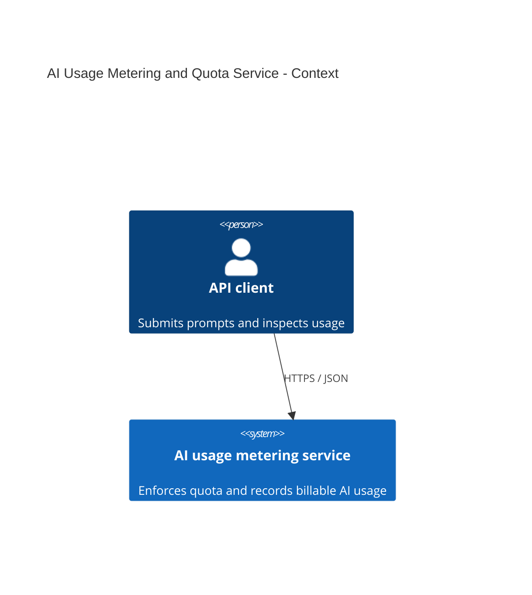
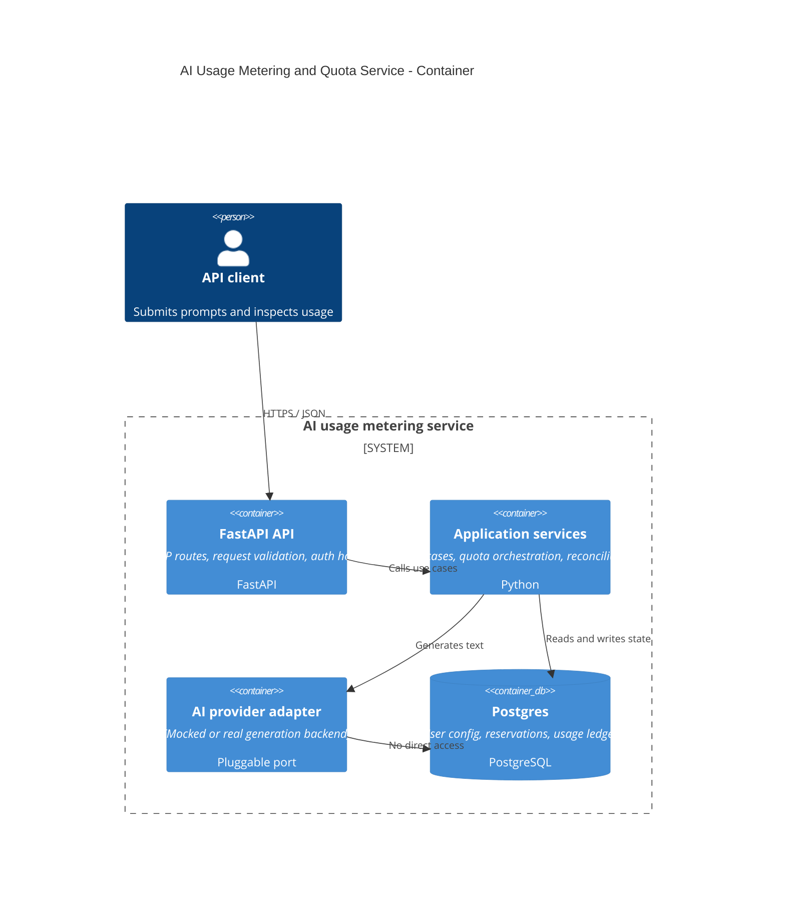

# C4 Diagrams

These diagrams show the service from two angles: the external context and the internal container split.

## Context View

## Container View

## Reading the diagrams

- The context view is the “what talks to what” picture.
- The container view is the “how the service is split” picture.
- The FastAPI layer stays thin.
- The application layer owns the quota and credit rules.
- Postgres is the durable source of truth.
- The AI provider remains pluggable so we can swap mock and real backends without changing the domain.
