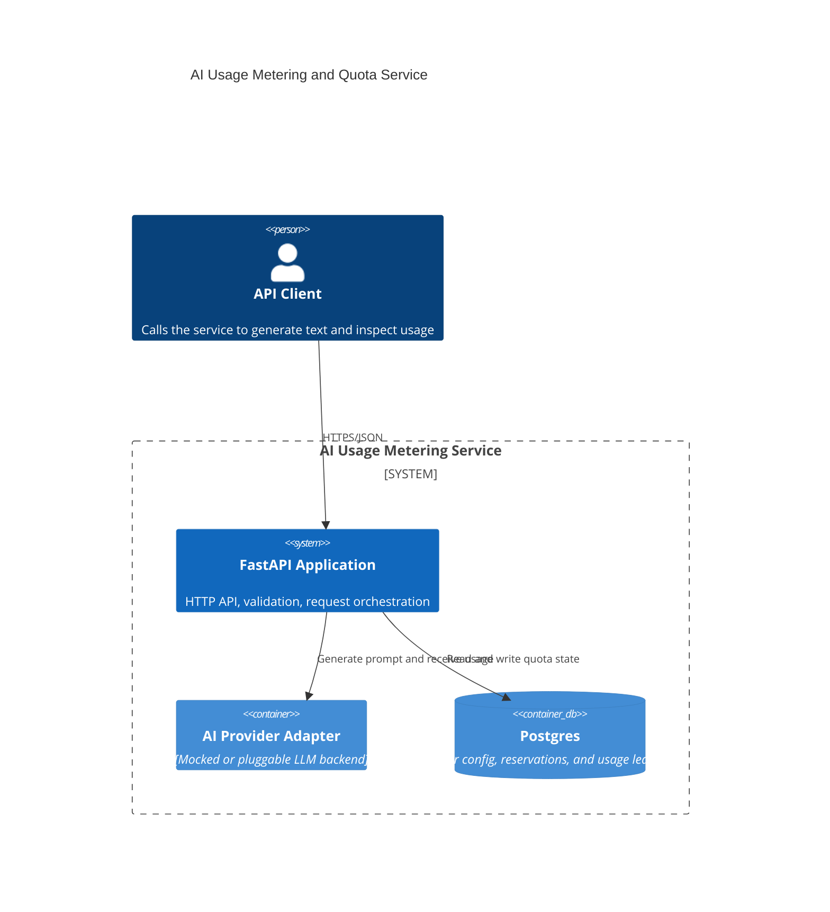

# C4 Diagram

This diagram shows the initial shape of the service using a DDD + hexagonal split.

## Reading the diagram

- The HTTP API is the inbound adapter.
- The application and domain layers own quota rules, credit math, and reconciliation.
- Postgres is the durable system of record.
- The AI adapter is pluggable so the backend can stay mocked during development or switch providers later.
