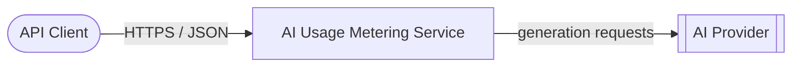
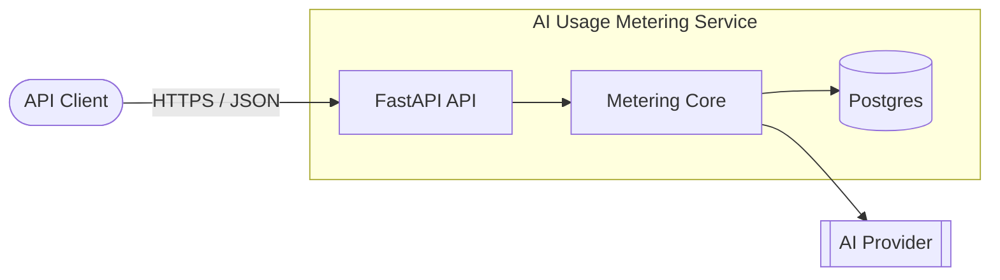

# C4 Diagrams

These diagrams show the service from two angles: the external context and the internal container split.

## Context View

## Container View

## Reading the diagrams

- The context view shows what talks to what.
- The container view shows how the service is split.
- FastAPI stays thin.
- The core owns quota and credit rules.
- Postgres is the source of truth.
- The AI backend is pluggable, so mock and real providers can be swapped later.
