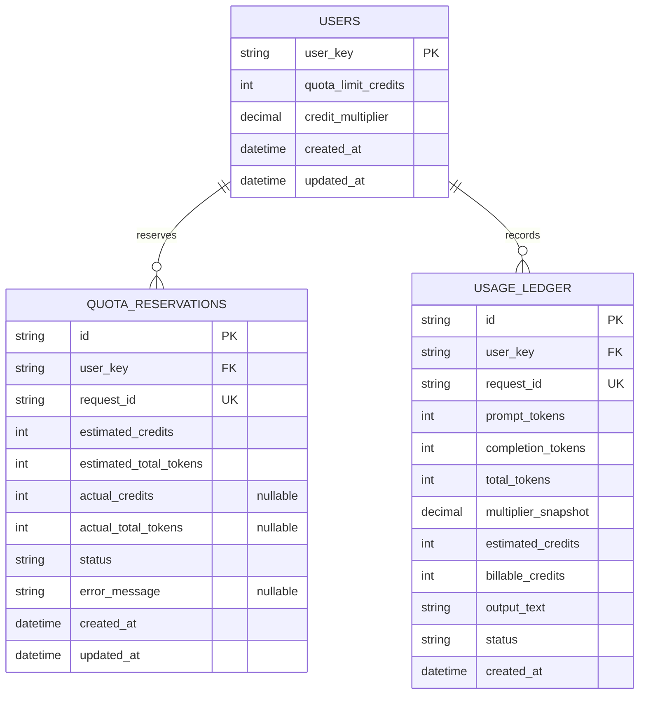

# Data Model

This document explains the persisted data model for the AI usage metering service.
It is intentionally small and mirrors the actual Postgres schema.

## ERD

## Tables

### `users`

One row per user. This is the quota policy record.

- `quota_limit_credits` is the user's configured allowance.
- `credit_multiplier` is the user's configured billing multiplier.
- `created_at` and `updated_at` track policy history.

### `quota_reservations`

Tracks the pre-generation reservation for a request.

- `estimated_credits` is computed before calling the AI layer.
- `estimated_total_tokens` is the prompt estimate plus the requested completion cap.
- `status` shows whether the reservation is `reserved`, `completed`, `failed`, `duplicate`, `in_progress`, `missing`, or `quota_exceeded`.
- `actual_credits` and `actual_total_tokens` are filled in after generation succeeds.
- `error_message` is used when a request fails.

### `usage_ledger`

The durable usage history and audit trail.

- One row per successful generation request.
- Stores the raw token counts returned by the AI layer.
- Stores `multiplier_snapshot` so old records remain explainable if the user later changes multiplier.
- Stores both estimated and final billable credits for auditing.
- Stores `output_text` so the generated response can be inspected later.

## Relationships

- A `user` can have many `quota_reservations`.
- A `user` can have many `usage_ledger` records.
- `request_id` is unique in both reservation and ledger tables so a request can be safely deduplicated.

## Important Rules

- Quota configuration lives on the `users` row.
- Reserved credits are counted separately from completed usage.
- Usage records are append-only once a request succeeds.
- The billable credit rule is deterministic: `ceil(total_tokens * credit_multiplier)`.
- Historical records keep the multiplier that was active when the request completed.

## Lifecycle Example

1. A user configures a quota row in `users`.
2. A request arrives and creates a `quota_reservations` row with estimated credits.
3. If the AI call succeeds, the service inserts a `usage_ledger` row and marks the reservation completed.
4. If the AI call fails, the reservation is marked failed and no ledger row is created.

This split keeps the policy state, in-flight request state, and audit history separate enough to reason about and test.
